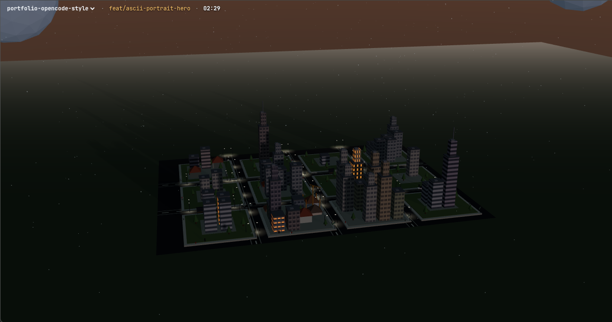

# gitopolis

A desktop toy: a 3D city that is a live view of a git repository.



Every tracked (or untracked-but-not-ignored) file is a building. File size sets height,
directory sets district, uncommitted files wear scaffolding and a crane, and committing
drops every crane at once. An in-game day runs in five real minutes, so the city has
weather, traffic, lit windows and a night sky of its own.

## Running it

```bash
npm install
npm run build                    # esbuild -> bundle.js, required before serving
node server.mjs ~/Desktop/dev    # then open http://localhost:4173
```

The argument is a **root**, not necessarily a repo: the server serves the root itself if
it is one, plus every direct child that is one. So point it at your projects folder and
switch between them from the dropdown in the top-left overlay — no restart.

```bash
node server.mjs .                # the current repo, the default
PORT=4180 node server.mjs ../foo # another port
npm run dev                      # rebuild on save
npm test                         # the derivation checks in test.mjs
```

Edit a file in the watched repo and its building grows a floor. Commit and every crane
drops at once.

## Why it works

The city is a pure projection of the working tree and is never persisted: restarting
produces an identical city, and `git checkout`, rebase, amend and force-push all morph it
for free. No assets either — every texture and mesh is generated at runtime.

See `CLAUDE.md` for the architecture.
